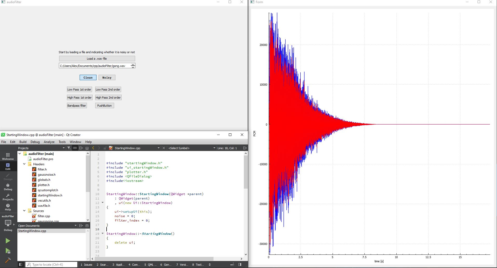
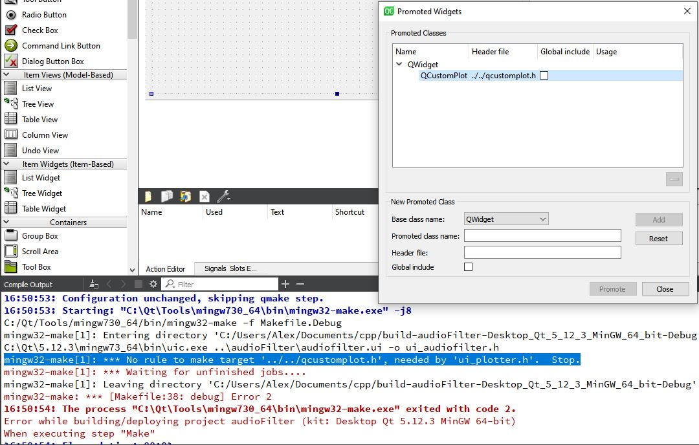

# Filter Audio signals using different IIR techniques

## Program description

Read a .wav file and perform IIR filtering on it. You may load a noisy signal or choose to add virtual noise to your file. The interface was developed using Qtcreator and qcustomplot for graph display. 

- The following filtering techniques are included:
  - Low pass 1st order
  - Low pass 2nd order
  - High pass 1st order
  - High pass 2nd order
  - Bandpass
- To execute the program: clone the repository, launch the executable, load a .wav file (you can use the provided sample), select your filter and interact with the results

To view the program source from qt, go to qtcreator->File->Open File or project... and select `audioFilter.pro` from this (repository) directory.

## Program structure
---
Overview of the files (other than `main.cpp`):

### `audiofilter.cpp/h`
Instantiates a form which opens a navigator window and allows to select a file with .wav extension. It then writes the string to the form. Afterwards, the program instantiates a `plotter.cpp` object and it passes the path-string to it. The plotter form is called using the heap approach, that is: reserving heap memory by calling like this:  `new Plotter();...`. Alternatively, one could use the modal approach which freezes the first window as described in [this video tutorial](https://www.youtube.com/watch?v=VigUMAfE2q4&ab_channel=ProgrammingKnowledge)

### `plotter.cpp/h`
Displays a form containing a qcustom plot widget (see qcustomplot), followed by a call to `wavfile.cpp`. This creates a wavfile object which reads the audio from the string passed to this class. Then, the graph for the plot gets displayed.  

### `wavfile.cpp/h`
The functionality of this script is better reflected in the [standalone version](wav_standalone/wav_standalone.cpp). The class takes the string and reads the Audio file contents into a QVector file

### `filter.cpp/h`

### Other files:
- `globals.h` sets global variables such as number of display samples, filter type, noise added or intrinsic...
- `vecutils.h` Vector operations for QVector class
- `qcustomplot.cpp/h` -> see program development section

## Structure of the program development

 

The graph uses the qcustomplot, wich  [this](https://www.qcustomplot.com/index.php/tutorials/basicplotting)

1. I started by following the [first tutorial](https://doc.qt.io/qtcreator/creator-writing-program.html) for window/form generation

2. The file browsing dialog is described in [this post](https://stackoverflow.com/questions/5602798/how-to-launch-a-file-browser-in-a-qt-application). I added a plain text widget in the ui to display the path

3. The graph framework is provided by qcustomplot as explained in the [setting up](https://www.qcustomplot.com/index.php/tutorials/settingup) tutorial.

4. To Make buttons checkable (properties, bottom right of the design window). Group them inside a widget and click on autoexclusive

_**Note 18/02/21**_ _Qt is event driven. The event loop is running in the background sending signals between widgets using the loop `a.exec()`_ [qt blog, a.exec()](https://forum.qt.io/topic/77706/when-will-a-widget-show-up-after-calling-show-or-after-entering-its-paint-event/6)

5. As opposed to the modeless addition of the plotter window, for the options dialog I used a [modal approach](https://doc.qt.io/qt-5/qdialog.html) when generating the widget form. This freezes the progress of the function which is an item in which I was stuck for some time (I couldn't pass arguments directly to the class and using different functions seemed a bad idea)

6. [parents](https://doc.qt.io/archives/qt-4.8/objecttrees.html)

## Collection of non-soverflow errors

|error message|error described|solved|
|:---:|:---:|:---:|
| `No rule to make target '../../qcustomplot.h', needed by 'ui_plotter.h'.  Stop`|This error was caused by an automatic update in the path to the qcustomplot file; caused by using the library on a different project in the same project tree. Fixed by renaming the promoted widget in the ui; as seen in the image below  | YES |
| `SIGSEGV segmentation fault (signal received qt dialog)` | I get this at fopen(fname) in wavfile.cpp the reason being that I convert the QString as follows | QString to char conversion should be done properly [see](https://stackoverflow.com/questions/2523765/qstring-to-char-conversion) |
| Plotter has no member... | After changing the name of the promoted customPlot widget. When re-naming the widget, the little red button on the picture needs to be clicked  | YES |  
| `...\moc_audiofilter.cpp:83: error: undefined reference to audioFilter::on_pushButton_2_clicked()` | Forgot to delete function for that slot in the header| YES |

## To do:
- [x] Make template with raw data so that not only int16 is accepted: actually this cannot be done since the selection happens at compile time; [this](https://stackoverflow.com/questions/495021/why-can-templates-only-be-implemented-in-the-header-file?rq=1) may be a solution 
- [ ] Create a live audio version of this software where microphone data can also be read and filtered
- [ ] Find a way to make all buttons in the group of filter options the same size
- [ ] In audiofilter.cpp (and .h) change the way teh filter option is selected. Now there is one function per click, there should be an easier way to do this
- [ ] Maybe abandon globals and pass the classes across each other
- [ ] re-scaling of the main widget does not work
- [ ] Put the contents of onfileclicked into onokayclicked and prevent the program from progressing if the path to the wavfile is null pointer
- [ ] ? support for mp3

### Current bugs
---
- [ ] The "noisy" option does not work
- [ ] 

http://freeverb3vst.osdn.jp/tips/iir_filter.shtml
